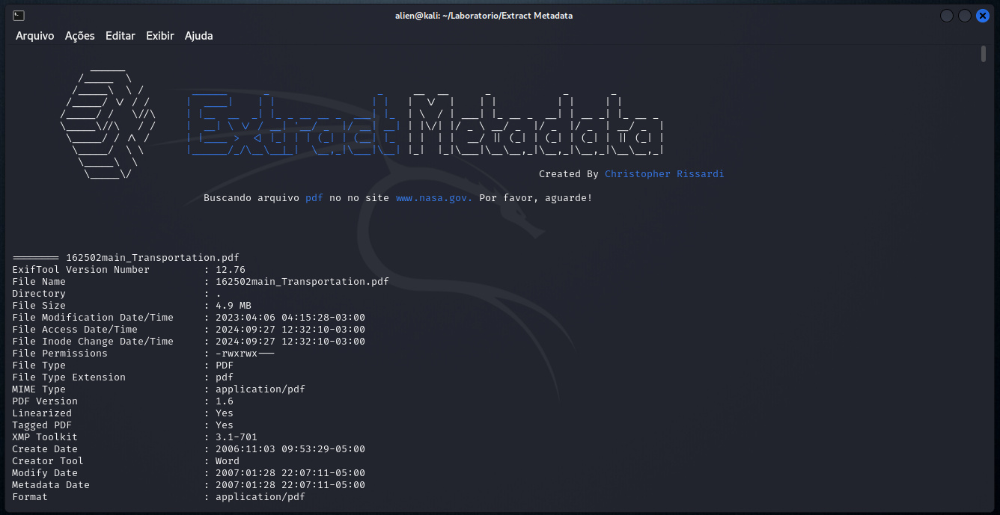

# Extract Metadata

Ferramenta para extrair metadados de arquivos a partir de um escopo específico. O script faz a varredura do site para encontrar tipos de arquivos indexados na pággina que o usuário deseja e extrai todos os metadados desses arquivos encontrados.





---

## ✔️ Requisitos

- Não é necessário nenhum requisito específico, somente uma máquina Linux.

## ⛏️ Como usar

1. Clone esse repositório usando a ferramenta do [git](https://git-scm.com/) ou baixe o repositório em ZIP clicando em `<> Code`

```bash
git clone https://github.com/cristopherrissardi/Hostscan.git
```

2. Entre na pasta do repositório clonado (Extract-Metadata-main)

```bash
cd Extract-Metadata-main
```

3. De permissão de execução ao script.

```bash
sudo chmod +x ./extract_metadata.sh
```

4. Execute a ferramenta passando os parâmetros corretos

```bash
./extract_metadata.sh URL DO SITE + TIPO DE ARQUIVO
```

Exemplo: 

```bash
./extract_metadata.sh www.nasa.gov pdf
```

OBS: A ferramenta suporta vários tipos de arquivos como `PDF`, `DOC`, `DOCX`, `RAW`, `XLS`, `XLSX`, `PPT`, `PPRTX` e outros. Use o qual desejar.


5. Aguarde o fim da varredura e terá os metadados dos arquivos extraídos.


### Observação.

1. Vale ressaltar que a ferramenta não é considerada anti-ético pelo fato de que os arquivos extraídos estão todos indexados na URL, ou seja, são todos dados públicos do site.
2. Ainda que a ferramenta não apresente risco nenhum a alguma entidade ou organização, qualquer uso indevido da ferramenta é de total responsabilidade do usuário.
3. Ao executar o script, será instalado (CASO O USUÁRIO NÃO TENHA) o navegador via linha de comando [Lynx](https://lynx.invisible-island.net/). Se a ferramenta for usada de forma constante ou excessiva, eventualmente o Google pedirá para confirmar o reCAPTCHA devido o motor de busca reconhecer como "Padrões suspeitos". Infelizmente como o navegador é totalmente via linha de comando, não é possível fazer essa confirmação de forma manual. Caso isso ocorra, sugiro que pause as requisições e tente novamente depois de alguns minutos e se for necessário reinicie a sua máquina/VM.


## 👁️‍🗨️ Observações finais

Caso queira criar um script próprio, fique a vontade para modificar e criar. Obrigado.